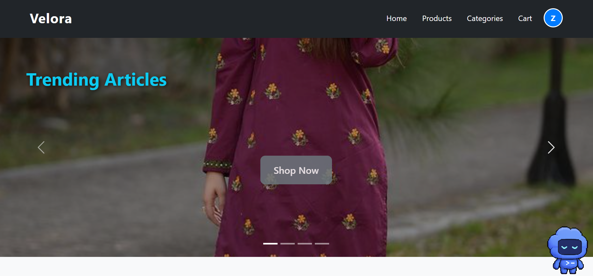
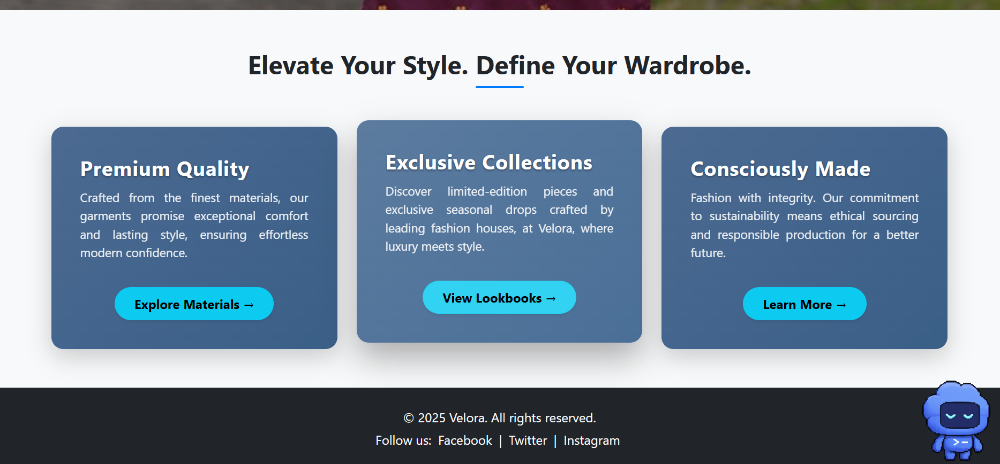

# Velora

Velora is a Django-based fashion e-commerce application that lets users discover products, manage a shopping cart, place orders, and share product reviews. It also provides a role-protected dashboard for managing the store catalogue.

## Features

- Browse a paginated fashion catalogue
- Search products by name
- Filter products by category, size, and price
- Sort products by price or newest items
- View product details, available sizes, stock, and customer reviews
- Register, log in, update a profile, and change a password
- Add products to a cart and complete checkout
- Create and review orders
- Submit reviews as an authenticated user
- Manage products and categories through an admin dashboard
- Import the sample product catalogue from JSON

## Tech Stack

- Python
- Django
- SQLite
- django-filter
- django-extensions
- django-widget-tweaks
- HTML, CSS, and JavaScript

## Screenshots

Add your screenshots to `docs/images/` using the filenames below. They will appear on GitHub after you add and commit the image files.

### Home Page



### Product Catalogue



## Project Structure

```text
velora-django-ecommerce/
├── ecommerce_site/          # Project configuration, shared templates, static assets
├── products/                # Product models, filters, templates, and catalogue importer
├── orders/                  # Cart, checkout, order, and payment logic
├── users/                   # Authentication, user profiles, and shipping addresses
├── dashboard/               # Product and category management dashboard
├── docs/images/             # Project screenshots used in this README
├── manage.py                # Django command-line entry point
├── requirements.txt         # Python dependencies
└── README.md
```

## Getting Started

### Prerequisites

- Python 3.12 or later
- Git

### Clone and install

```powershell
git clone https://github.com/ZahraYasin2209/velora-ecommerce.git
cd velora-ecommerce
python -m venv .venv
.\.venv\Scripts\Activate.ps1
python -m pip install --upgrade pip
pip install -r requirements.txt
```

### Set up the database

```powershell
python manage.py migrate
```

### Import the product catalogue

```powershell
python manage.py load_product_catalog_json_and_populate_models
```

### Run the application

```powershell
python manage.py runserver
```

Visit [http://127.0.0.1:8000/](http://127.0.0.1:8000/) in your browser.

## Admin Access

Create an administrator account:

```powershell
python manage.py createsuperuser
```

After starting the server, log in at [http://127.0.0.1:8000/admin/](http://127.0.0.1:8000/admin/).

## Useful Commands

```powershell
# Check the project configuration
python manage.py check

# Create model migrations
python manage.py makemigrations

# Apply migrations
python manage.py migrate

# Import or update the sample catalogue
python manage.py load_product_catalog_json_and_populate_models
```

## Author

Zahra Yasin
